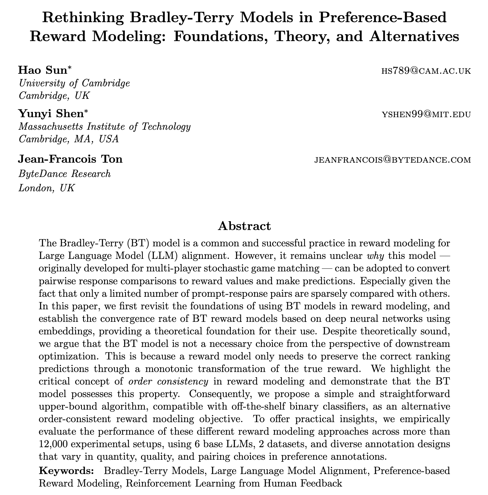
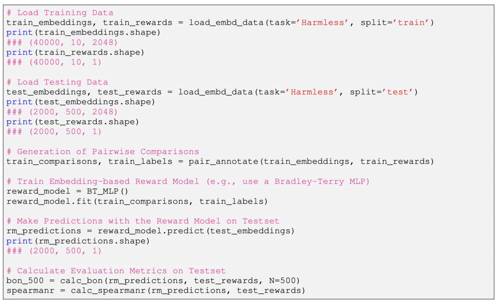

# 🚀 Official Implementation for [ICLR'2025 Oral Paper](https://openreview.net/forum?id=rfdblE10qm)




### &nbsp;&nbsp;&nbsp; 🌍 [ [Website] ](https://sites.google.com/view/rewardmodels)  &nbsp;&nbsp;&nbsp;    |  &nbsp;&nbsp;&nbsp;    📖 [ [Preprint] ](https://arxiv.org/pdf/2411.04991)    &nbsp;&nbsp;&nbsp;   |   &nbsp;&nbsp;&nbsp;     📚 [ [Embeddings (To be released soon)] ]()   &nbsp;&nbsp;&nbsp; |   &nbsp;&nbsp;&nbsp;     ⚙️ [ [Infrastructure] ](https://github.com/holarissun/embedding-based-llm-alignment)   


---
_We have a series of work focusing on **embedding-based** reward models in RLHF:_
- Part I. Reward Model Foundation (This paper: foundation of preference-based reward modeling and embedding-based reward models)
- Part II. Active Reward Modeling ([[preprint](https://arxiv.org/abs/2502.04354)], [[repo](https://github.com/YunyiShen/ARM-FI?tab=readme-ov-file)])
- Part III. Accelerating Reward Model Research with our Infra.  ([[preprint](https://arxiv.org/pdf/2502.04357)], [[repo](https://github.com/holarissun/embedding-based-llm-alignment)])
- Part IV. Human Preference Learning through Principal Component Analysis ([[preprint](https://arxiv.org/pdf/2502.13131)])
----
## ⚙️ Infra for Easy-Reproducible Reward Model Research
The reproduction for reward modeling research has long been a challenge, given its high demand for hardware and cost in training, evaluation, and inference. We propose to conduct easy-reproducible reward model research on the embedding space.

This paper posits details of the workflow: [Part III. TO BE RELEASED SOON.]. Our motivation is to make it possible for every researcher with a single CPU to conduct reward modeling (and RLHF) research.

## 🔁 Reproducing the Results without GPUs
- Step 1 (optional, GPU required): SFT (you need to update the PATH to the models/open-sourced datasets. You may need to apply for licences to use those models/datasets first.) Note that
```python
python3 step1_sft.py --model_name gemma2b --dataset hh-rlhf-helpful-gpt4
```

- Step 2 (optional, GPU required): Generate samples on training (10 per prompt) and testing prompts (500 per prompt)
```python
python3 step1_sft.py --model_name gemma2b --dataset hh-rlhf-helpful-gpt4
```

- Step 3 (optional, GPU required): annotating response qualities using golden reward models
```python
python3 step1_sft.py --model_name gemma2b --dataset hh-rlhf-helpful-gpt4
```

- Step 4 (optional, GPU required): Generate and store embeddings of all prompt-response pairs
```python
python3 step1_sft.py --model_name gemma2b --dataset hh-rlhf-helpful-gpt4
```

#### The above 4 steps enable us to create an embedding-based dataset, then we can easily reproduce any research with such a dataset

To illustrate:


- Step 5 (reproduction: reward model training with CPUs)
- Step 6 (reproduction: reward model evaluation with CPUs)


## Call for Contribution to the Infra (an Embedding-based Dataset for Reward Modeling Research)

`Call for contributors! --- Please contact me at sunhopht@gmail.com if your are interested in contributing your embedding / golden-reward annotations in your reward model research to the open-source RM community!`


